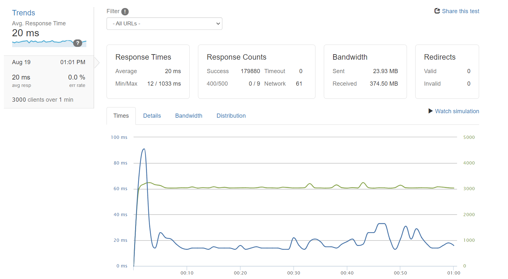

# Questions-and-Answers

### Databases Used:
* MongoDB - non-relational
* Postgres - relational

### Steps to Start
* Make sure Postgres is running on your computer
* run ```npm run start``` to start server.

### Quick Start
* clone this repository and navigate to it from your terminal
* ```npm run start``` to start up the server

### Summary
This is a backend server application designed to fetch and provide information to a frontend retail e-commerce application. This application was created and designed to be both vertically and horizontally scaled to accomodate thousdands of reqeusts coming in per second. The vertical scaling consisted of optimizing the database queries by utilizing join tables, caching, and indexing the tables.
I then used horizontal scaling efforts by spinning up 3 AWS server instances. I used Nginx as a load balancer to split the incoming traffic to the different instances. I was able to handle up to 2500 requests per second after utilizing both of these strategies.

## Tech Stack
* MongoDB
* PostgreSQL
* ExpressJS
* K6
* Supertest
* Jest
* Nginx

#### Images
1. k6 load testing for local database query speeds


2. Loader.io Cloud testing through multiple server instances
